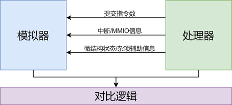
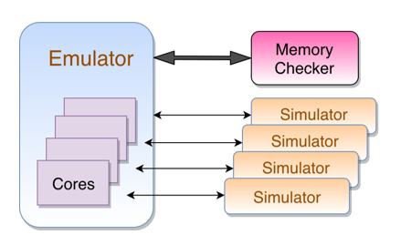

# difftest源码注解

## difftest简介

### 语雀

[语雀文档](https://xiangshan.yuque.com/euzvvh/cv6gyu/kr97kx)

### difftest profile

`difftest`，别名差分测试法。是当前“香山”处理器开发的一种验证方法。他是利用一个正确实现的

`RISC-V`模拟器作为 `ref`，和当前开发的处理器作为dut（device under tes），使ref和dut都运行相同的程序，并且每运行一条指令或数条指令，就将dut处理器的状态（PC值、32个通用寄存器、CSR ··· ···）和ref的处理器状态进行一次对比，对比结果相同则继续运行后续的指令，如若对比结果出现不一致，则会停止处理器的执行，并报告相应的 `debug`信息。



### 香山 `SMP Difftest`的实现

利用 `verilator`将 `chisel`生成的 `verilog`代码编译封装成 `c++`文件，其中生成的 `c++`文件描述了所设计的微架构，并提供相应的方法模拟微架构的时钟推进来仿真微架构的运行(主要以 `c++`的类进行抽象)。

#### 仿真运行

将 `verilog`编译成 `c++`文件后，我们需要自己编写仿真程序。具体而言，新建 `c++`的源文件，在该源文件中创建上述类的对象，该对象会有时钟信号和复位信号接口（在 `verilog`中的顶层模块接口必须有的，`chisel`会自动生成 `clock`和 `reset`信号接口），对clock信号结果交替输入0和1的值，并用类提供的方法更新其他信号值，从而模拟了微架构时钟周期的递进。

下一章节使用 `verilator`仿真运行一个简单的例子作为演示）。此时将该源文件和 `verilator`生成抽象出来的c++文件一起编译成elf文件，即可运行仿真所设计的处理器核微架构电路逻辑。

#### difftest的加入

此时有了时钟周期递进的仿真过程，difftest即可在每一个周期推进后，查看dut下是否有指令在处理器流水线内完成了提交，如果有提交，则根据提交指令数，利用在 `c++`源文件内已经初始化的与ref进行交互的接口，让正确的ref模拟器提交相同的指令和指令数，并进行处理器状态的结果对比，如果对不不一致，则认为dut内部逻辑设计有bug，停止仿真程序的运行，并输出相应的debug信号去debug相应的电路逻辑。

```cpp
while(1) {
  single_cycle();
  difftest();
}
```

## verilator

[verilator官网](https://www.veripool.org/verilator/)

`verilator`是一种开源的、高速模拟的 `verilog/SystemVerilog`模拟工具。它的高速体现在利用 `c/c++`语言的快速执行。

* Accepts synthesizable Verilog or SystemVerilog
* Performs lint code-quality checks
* Compiles into multithreaded C++, or SystemC
* Creates XML to front-end your own tools

### 简单例子——计数器

> 我们需要一个verilog文件来进行一个小实验，选择用chisel来生成一个模块。写一个简单的电路模块，比如用chisel写一个计数器，每个周期计数器加1，当达到最大值时向接口发出一个信号。使用一个顶层模块（这里名称使用 `SimTop`与香山一致的名称，也可使用其他任意符合命令规范的名称或不使用）来例化该模块。代码如下：

#### chisel代码

```scala
package mycounter

import chisel3._
import chisel3.stage.ChiselGeneratorAnnotation
import chisel3.util._
import firrtl.options.TargetDirAnnotation

class MyCounter(max: Int = 16) extends Module {
  val io = IO(new Bundle() {
    val tick = Output(Bool())
  })
  val c = Counter(max)
  c.inc()
  io.tick := c.value === (max-1).U
}

class SimTop extends Module {
  val io = IO(new Bundle() {
    val tick = Output(Bool())
  })
  val my_counter = Module(new MyCounter())
  io.tick := my_counter.io.tick
}

object SimTop extends App {
  (new chisel3.stage.ChiselStage).execute(
    Array("-X", "verilog", "--full-stacktrace"),
    Seq(ChiselGeneratorAnnotation(() => new SimTop()),
      TargetDirAnnotation("build/"))
  )
}
```

#### chisel生成verilog

使用 `scala`构建工具 `mill`生成verilog，**此处命令不唯一**

在上面指定的输出目录 `"build/"`下能看到

```bash
SimTop.anno.json  SimTop.fir  SimTop.v
```

其中的 `SimTop.v`为chisel最终生成的 `verilog`文件，将这个 `verilog`文件放入到当前project的src/verilog目录下：

#### verilator命令参数

现在使用verilator工具将RTL（verilog）编译封装为 `c++`文件

查看 `verilator`版本

```bash
Verilator 4.204 2021-06-12 rev v4.204
```

可通过 `verilator --help`或官网文档查看相关参数的功能。

下面介绍一些相关参数

`--cc` 或 `--sc`：verilator将 `Verilog/SystemVerilog`生成 `C++` 或 ` SystemC`相应的代码。

`--top-modules`：该参数用于指定输入的 `Verilog/SystemVerilog`文件中的顶层模块名，若仅有一个顶层模块 `verilator`可自动识别，若有多个顶层模块需要该参数来指定

`--Mdir`：指定输出文件的目录，若未指定则默认 `"obj_dir"`

`--exe`：该参数会创建 `Makefile`文件用于生成可执行文件(`.elf`)或静态库文件(`.a`)

`--build`：该参数调用 `GNU Make`或 `CMake`编译模块

`--trace`：打开波形生成

`-I`：

`-o`：指定生成的可执行文件(`.elf`)或静态库文件(`.a`)

`-CFLAGS <flags>`：指定Makefile中 C++ 编译器参数

`--savable`： Enable including save and restore functions in the generated model

**调试参数**

--Wall

--lint-only

--xml-only

#### 使用verilator生成可执行文件

将verilog封装成c文件，

`yangye@xiangshan-54:~/projects/counter$ verilator --cc  src/verilog/MyCounter.v`

未指定 `--Mdir`参数，则输出文件默认在 `"obj_dir"`目录下

```bash
yangye@xiangshan-54:~/projects/counter$ ll obj_dir/
total 48
drwxr-xr-x 2 yangye xs 4096 12月 24 10:55 ./
drwxr-xr-x 7 yangye xs 4096 12月 24 10:55 ../
-rw-r--r-- 1 yangye xs 1592 12月 24 10:55 VSimTop_classes.mk
-rw-r--r-- 1 yangye xs 4556 12月 24 10:55 VSimTop.cpp
-rw-r--r-- 1 yangye xs 3247 12月 24 10:55 VSimTop.h
-rw-r--r-- 1 yangye xs 1438 12月 24 10:55 VSimTop.mk
-rw-r--r-- 1 yangye xs 2564 12月 24 10:55 VSimTop__Slow.cpp
-rw-r--r-- 1 yangye xs  639 12月 24 10:55 VSimTop__Syms.cpp
-rw-r--r-- 1 yangye xs  818 12月 24 10:55 VSimTop__Syms.h
-rw-r--r-- 1 yangye xs  266 12月 24 10:55 VSimTop__ver.d
-rw-r--r-- 1 yangye xs 1170 12月 24 10:55 VSimTop__verFiles.dat
```

> 我们可以查看 `verilog`抽象封装成的 `C++`类，在 `VSimTop.h`声明，可以打开该文件，我们能看到封装的类和*顶层接口*以及定义的评估方法。该类里提供了两个方法：`eval()` or `eval_step()`。当这两个函数被调用时，Verilator查找时钟信号的变化并评估相关的顺序always块，例如计算 `always_ff @ (posedge…)`输出。然后Verilator评估组合逻辑。
> 通俗来说，`eval()` or `eval_step()`方法的调用，会根据外部输入值来更新内部所有的信号。利用这个方法的功能，我们可以实现一个周期的仿真：顶层模块一般都有 `clock`接口，可以给予clock接口一个高电平信号，调用 `eval()` or `eval_step()`评估内部所有信号值，再给予clock接口一个低电平信号，再调用 `eval()` or `eval_step()`评估内部所有信号值，这样就可以实现所设计的模块内所有信号值在一个时钟周期的仿真。再给这个过程以循环的方式，就达到了周期不断推进的仿真过程。

执行生成的 `makefile`文件（`VSimTop.mk`），会生成不同的二进制文件

```bash
yangye@xiangshan-54:~/projects/counter$ make -C obj_dir/ -f VSimTop.mk
```

生成二进制文件

```bash
yangye@xiangshan-54:~/projects/counter$ ll obj_dir/
total 72
drwxr-xr-x 2 yangye xs 4096 12月 24 10:57 ./
drwxr-xr-x 7 yangye xs 4096 12月 24 10:55 ../
-rw-r--r-- 1 yangye xs 6176 12月 24 10:57 VSimTop__ALL.a
-rw-r--r-- 1 yangye xs  173 12月 24 10:57 VSimTop__ALL.cpp
-rw-r--r-- 1 yangye xs  272 12月 24 10:57 VSimTop__ALL.d
-rw-r--r-- 1 yangye xs 5200 12月 24 10:57 VSimTop__ALL.o
-rw-r--r-- 1 yangye xs 1592 12月 24 10:55 VSimTop_classes.mk
-rw-r--r-- 1 yangye xs 4556 12月 24 10:55 VSimTop.cpp
-rw-r--r-- 1 yangye xs 3247 12月 24 10:55 VSimTop.h
-rw-r--r-- 1 yangye xs 1438 12月 24 10:55 VSimTop.mk
-rw-r--r-- 1 yangye xs 2564 12月 24 10:55 VSimTop__Slow.cpp
-rw-r--r-- 1 yangye xs  639 12月 24 10:55 VSimTop__Syms.cpp
-rw-r--r-- 1 yangye xs  818 12月 24 10:55 VSimTop__Syms.h
-rw-r--r-- 1 yangye xs  266 12月 24 10:55 VSimTop__ver.d
-rw-r--r-- 1 yangye xs 1170 12月 24 10:55 VSimTop__verFiles.dat
```

如果说verilator生成的文件还需要用户自己写编译脚本将其加入到自己的仿真程序中这样不方便于用户的使用。
为了快速地生成可执行文件，而不用让用户来手动添加这些文件到自己测试源文件中进行编译，

> `verilator`在使用时将设计的 `Verilog/SystemVerilog`文件和编写仿真的源文件一起作为 `verilator`的输入文件，编译后生成相应的 `Makefile`文件会有相应的过程将封装出来的（由 `Verilog/SystemVerilog`转换）文件与用户编写的测试源文件一起编译链接成最后的可执行文件(`.elf`)或动态链接库文件(`.so`)，用户只需执行生成的 `Makefile`文件即可生成最终的可执行文件(`.elf`)。

接下来实验一下相关过程：

#### 测试程序

将仿真的源文件也作为 `verilator`的输入文件（`cpp`源文件最好指定绝对路径，可编写 `Makefile`来帮助我们快速构建执行过程）：

首先编写自定义仿真程序，由上可知封装的文件的声明在头文件 `VSimTop.h`(`Verilator`输出文件命名为 `Verilog/SystemVerilog`的顶层模块的名称前面加大写 `V`)，因此在我们的cpp文件里需要 `#include <VSimTop.h>`(`src/cpp/main.cpp: 4`)，见源码 `src/cpp/main.cpp`。
生成波形的相关代码由宏定义 `VCD_ENABLE`来展开，该处直接在源文件中定义，`verilator`命令可以添加编译参数，也可在编译参数中来指定该宏定义。
构建一个名为Emu的类来将仿真的过程抽象，定义成员变量 `VSimTop *dut;`，该变量指向所设计的 `verilog`模块经 `verilator`封装后的 `C++`类，在构造函数中初始化：

```cpp
Emu::Emu(/* args */): dut(new VSimTop) {
#ifdef VM_TRACE
  vcd_times = 0;
#endif
}
```

定义方法 `Emu::single_cycle()`实现周期推进，在上面已经了解了封装后的类提供 `eval()`或 `eval_step()`方法，因此可以通过给 `clock`接口交替赋值交替调用 `eval()`或 `eval_step()`方法来实现一个周期的推进(宏 `VCD_ENABLE`为波形生成的相关代码暂时不管)：

```cpp
void Emu::single_cycle() {
  dut->clock = 0;
  dut->eval();
#ifdef VCD_ENABLE
  tfp->dump(vcd_times++);
#endif
  dut->clock = 1;
  dut->eval();
#ifdef VCD_ENABLE
  tfp->dump(vcd_times++);
#endif
}
```

同理可在 `Emu`类里实现一个复位参数个周期的方法，只需要给外部接口 `reset`赋值并调用 `eval()`或 `eval_step()`方法：

```cpp
void Emu::reset_n(uint64_t n) {
  while (n--) {
    dut->reset = 1;
    dut->clock = 0;
    dut->eval();
#ifdef VCD_ENABLE
    tfp->dump(vcd_times++);
#endif
    dut->clock = 1;
    dut->eval();
    dut->reset = 0;
#ifdef VCD_ENABLE
    tfp->dump(vcd_times++);
#endif
  }
}
```

然后定义一个方法 `Emu::execute()`用于不断周期推进直到自定义什么情况下结束仿真：

> Emu类里定义了一个变量 `state`用于定义 `Emu`仿真的状态，该变量有两个值 `enum { RUN, STOP };`用于表示是运行还是退出状态；仿真刚开始时将state初始化为 `RUN`状态，定义 `update_state()`方法用于在每一个周期刷新状态，其定义如下：

```cpp
void update_state() { if(state == RUN && dut->io_tick == 1) state = STOP; }
```

由定义可知如果顶层模块的接口 `io_tick`输出信号为高，则将 `state`置 `STOP`状态，由前面所设计的模块可知，当计数器达到最大计数值值将在接口 `io_tick`输出高店平信号（模拟值1）。

定义 `Emu::execute()`方法：

> 该方法用 `while() { ... }`循环去调用 `update_state();`和 `single_cycle();`方法，也就是每一次循环都更新 `Emu`的状态和仿真一个周期，循环退出的条件判断为 `!isFinish()`，其定义 `bool isFinish() { return state == STOP; }`即 `state`状态变量为 `STOP`状态就停止仿真。

```cpp
void Emu::execute() {
#ifdef VCD_ENABLE
    Verilated::traceEverOn(true);	// Verilator must compute traced signals
    VL_PRINTF("Enabling waves...\n");
    tfp = new VerilatedVcdC;
    dut->trace(tfp, 99);	// Trace 99 levels of hierarchy
    tfp->open("build/emu_wave.vcd");	// Open the dump file
#endif
  // set state
  state = RUN;
  printf("\t simulation: start ...\t\n");
  reset_n(2);
  while (!isFinish()) {
    // check emu state
    update_state();
    // run a cycle
    single_cycle();
  }
#ifdef VCD_ENABLE
  tfp->close();
#endif
  dut->final();
  printf("\t simulation: end ...\t\n");
}
```

至此，一个基本的仿真架构已经搭建好，然后再 `main`函数里创建该 `Emu`类，调用该类的 `Emu::execute()`执行仿真即可：

```cpp
int main() {
  auto emu = new Emu;
  emu->execute();
  return 0;
}
```

该实验的目录结构

```bash
yangye@xiangshan-54:~/projects/counter$ tree
.
├── difftest
│   ├── difftest.md
│   └── image
├── Makefile
├── README.md
└── src
    ├── cpp
    │   └── main.cpp
    └── verilog
        └── SimTop.v

6 directories, 7 files
```

构建 `Makefile`脚本来自动化编译生成，在该project目录下的 `Makefile`里已经写好，为体现过程，实现了分步的目标

第一步：在project目录下输入 `make verilator`, 执行verilator命令将verilog文件、cpp源文件作输入文件一起输出，其实际执行命令如下（见 `Makefile`源文件）：

```bash
verilator --cc --exe --top-module MyCounter -I/home54/yangye/projects/counter/build -Mdir /home54/yangye/projects/counter/build/verilator-out -o /home54/yangye/projects/counter/build/emu --trace src/verilog/MyCounter.v /home54/yangye/projects/counter/src/cpp/main.cpp
```

上述参数 `-Mdir`指定了输出文件的位置，`-o`指定了最终可执行文件的位置，`verilator`支持传入 `c++`参数
可在指定的路径下看到输出的所有文件

[verilator输出文件类型](https://verilator.org/guide/latest/files.html#files-read-written)

```bash
yangye@xiangshan-54:~/projects/counter$ ll build/verilator-out/
total 344
drwxr-xr-x 2 yangye xs   4096 12月 24 11:58 ./
drwxr-xr-x 3 yangye xs   4096 12月 24 11:58 ../
-rw-r--r-- 1 yangye xs    404 12月 24 11:58 main.d
-rw-r--r-- 1 yangye xs   6792 12月 24 11:58 main.o
-rw-r--r-- 1 yangye xs    453 12月 24 11:58 verilated.d
-rw-r--r-- 1 yangye xs 178904 12月 24 11:58 verilated.o
-rw-r--r-- 1 yangye xs    479 12月 24 11:58 verilated_vcd_c.d
-rw-r--r-- 1 yangye xs  55704 12月 24 11:58 verilated_vcd_c.o
-rw-r--r-- 1 yangye xs  11904 12月 24 11:58 VSimTop__ALL.a
-rw-r--r-- 1 yangye xs    239 12月 24 11:58 VSimTop__ALL.cpp
-rw-r--r-- 1 yangye xs    496 12月 24 11:58 VSimTop__ALL.d
-rw-r--r-- 1 yangye xs  10456 12月 24 11:58 VSimTop__ALL.o
-rw-r--r-- 1 yangye xs   1653 12月 24 11:58 VSimTop_classes.mk
-rw-r--r-- 1 yangye xs   4630 12月 24 11:58 VSimTop.cpp
-rw-r--r-- 1 yangye xs   4130 12月 24 11:58 VSimTop.h
-rw-r--r-- 1 yangye xs   1921 12月 24 11:58 VSimTop.mk
-rw-r--r-- 1 yangye xs   2674 12月 24 11:58 VSimTop__Slow.cpp
-rw-r--r-- 1 yangye xs    689 12月 24 11:58 VSimTop__Syms.cpp
-rw-r--r-- 1 yangye xs    986 12月 24 11:58 VSimTop__Syms.h
-rw-r--r-- 1 yangye xs   1503 12月 24 11:58 VSimTop__Trace.cpp
-rw-r--r-- 1 yangye xs   3532 12月 24 11:58 VSimTop__Trace__Slow.cpp
-rw-r--r-- 1 yangye xs    766 12月 24 11:58 VSimTop__ver.d
-rw-r--r-- 1 yangye xs   2084 12月 24 11:58 VSimTop__verFiles.dat
```

接下来需要执行生成的 `Makefile`脚本 `VSimTop.mk`。

输入 `make emu`命令执行该生成的 `Makefile`脚本 `VSimTop.mk`。
实际执行命令如下（见 `Makefile`源文件）：

```bash
make -C build/verilator-out -f VMyCounter.mk
```

可以看到在指定路径下生成了可执行文件 `emu`，

```bash
yangye@xiangshan-54:~/projects/counter$ ll build/
total 172
drwxr-xr-x 3 yangye xs   4096 12月 24 12:05 ./
drwxr-xr-x 6 yangye xs   4096 12月 24 12:05 ../
-rwxr-xr-x 1 yangye xs 160032 12月 24 12:05 emu*
drwxr-xr-x 2 yangye xs   4096 12月 24 12:05 verilator-out/
```

运行 `emu`，输入 `build/emu`或 `make`或 `make run`，即可看到在源码里定义的打印信息表示仿真的开始与结束。

```bash
Enabling waves...
         simulation: start ...
         simulation: end ...
```

可在源码或编译参数里定义展开生成波形文件的源代码，运行 `emu`即可生成波形文件，这里方便阅读直接在源码里定义生成波形的宏定义将相关代码已经展开，因此运行 `emu`后会在指定路径生成波形文件，如下：

```bash
yangye@xiangshan-54:~/projects/counter$ ll build/
total 176
drwxr-xr-x 3 yangye xs   4096 12月 24 12:07 ./
drwxr-xr-x 6 yangye xs   4096 12月 24 12:05 ../
-rwxr-xr-x 1 yangye xs 160032 12月 24 12:05 emu*
-rw-r--r-- 1 yangye xs   1086 12月 24 12:07 emu_wave.vcd
drwxr-xr-x 2 yangye xs   4096 12月 24 12:05 verilator-out/
```

打开该波形文件，可以看到波形对应了前面计数器的逻辑信号值：


至此，以一个简单的步骤实验了一下利用 `verilator`开源工具把 `Verilog/SystemVerilog`封装为 `C++`文件的过程，并编写 `C++`源码，在该源码里创建 `verilator`封装的 `C++`类去仿真运行并打印波形文件。可以发现，verilator负责将封装成 `C++`类，提供接口赋值和方法以供仿真调用后，剩下的操作都交给了仿真程序的程序员，因此仿真程序可以根据程序员的定制功能具有很大的自由度，可根据不同的需求使用 `C++`或 `SystemC`定制不同的功能。`difftest`则是其仿真程序中开发的一种用于调试的功能。

可以观察到仿真执行的核心源代码：

```cpp
while (!isFinish()) {
    ......
    // run a cycle
    single_cycle();
    ......
}
```

一个循环体，其判断条件为自定义的是否结果模拟运行，每一次循环执行一个周期。我们考虑模拟的不再是一个计数器，而是一个正在设计的CPU处理器核，在这个循环体内，怎么去执行difftest的对比功能。处理器每执行一个周期

`single_cycle()`后，都有可能完成一条或多条指令的提交，因此在 `single_cycle()`后，可以去检查我们设计的处理器是否有提交指令（可将提交的信号由顶层接口给出或者利用 `verilator`支持的 `"DPI-C"`），若检查到有提交，则让正确实现的ref模拟器执行同样的指令数（需要有 `ref`的调用接口），并对比执行后处理器的状态，这样去搭建一个 `difftest`的功能。

我们可以在香山的difftest的源码里，找到这样类似的循环仿真一个周期的递进：

```cpp
// difftest/src/test/csrc/verilator/emu.cpp: 351
while (!Verilated::gotFinish() && trapCode == STATE_RUNNING) {
    ......
    single_cycle();
    ......
}
```

下一章进行一些香山的 `difftest`的源码注解吧。

## 香山difftest源码

`difftest`是将一个正在设计的模型（在这之后都称作 `dut`）和一个正确实现的模型（在这之后称作 `ref`）进行执行结果的对比。

### SMP difftest



difftest源码目录结构

```bash
yangye@xiangshan-54:~/xs-env/XiangShan/difftest$ tree -L 4
.
├── config
│   ├── config.h
│   └── verilator.mk
├── doc
│   ├── example-nutshell.md
│   ├── example-xiangshan.md
│   └── usage.md
├── LICENSE
├── Makefile
├── README.md
├── src
│   ├── main
│   │   └── scala
│   │       └── Difftest.scala
│   └── test
│       ├── csrc
│       │   ├── common
│       │   ├── difftest
│       │   ├── plugin
│       │   ├── vcs
│       │   └── verilator
│       └── vsrc
│           ├── common
│           └── vcs
├── vcs.mk
└── verilator.mk

15 directories, 11 files
```

在 `difftest/src/test/csrc/difftest/difftest.h`声明了difftest所有的类型方法。

首先声明了处理器的状态需要的数据结构（根据不同的事件类型进行了分类，各事件的信号值也在该文件进行了定义）如下：

```cpp
// difftest/src/test/csrc/difftest/difftest.h: 172
typedef struct {
  trap_event_t      trap;
  arch_event_t      event;
  instr_commit_t    commit[DIFFTEST_COMMIT_WIDTH];
  arch_reg_state_t  regs;
  arch_csr_state_t  csr;
  sbuffer_state_t   sbuffer[DIFFTEST_SBUFFER_RESP_WIDTH];
  store_event_t     store[DIFFTEST_STORE_WIDTH];
  load_event_t      load[DIFFTEST_COMMIT_WIDTH];
  atomic_event_t    atomic;
  ptw_event_t       ptw;
  refill_event_t    refill;
  run_ahead_event_t runahead[DIFFTEST_RUNAHEAD_WIDTH];
  run_ahead_commit_event_t runahead_commit[DIFFTEST_RUNAHEAD_WIDTH];
  run_ahead_redirect_event_t runahead_redirect;
  run_ahead_memdep_pred_t runahead_memdep_pred[DIFFTEST_RUNAHEAD_WIDTH];
  physical_reg_state_t pregs;
} difftest_core_state_t;
```

对于 `dut`的执行，一次提交可能包含多条指令，为了保存较多的调试信息，声明了一个 `DiffState`类，该类用于 `dut`提交指令信息后将重要的信息保存下来。
可以看到该类用数组实现了一些队列，并提供相应的方法将信息（`PC、inst、wen、wdst、wdata`等等）记录到队列并且入队指针+1。

> `record_group`: 记录最近历史进行对比的提交指令相关信息
> `record_inst`: 记录 `dut`提交的指令相关信息
> `record_abnormal_inst`: 记录因中断/异常而取消的指令

```cpp
// difftest/src/test/csrc/difftest/difftest.h: 197
class DiffState {
public:
  DiffState();
  void record_group(uint64_t pc, uint64_t count) {
    retire_group_pc_queue [retire_group_pointer] = pc;
    retire_group_cnt_queue[retire_group_pointer] = count;
    retire_group_pointer = (retire_group_pointer + 1) % DEBUG_GROUP_TRACE_SIZE;
  };
  void record_inst(uint64_t pc, uint32_t inst, uint8_t en, uint8_t dest, uint64_t data, bool skip) {
    retire_inst_pc_queue   [retire_inst_pointer] = pc;
    retire_inst_inst_queue [retire_inst_pointer] = inst;
    retire_inst_wen_queue  [retire_inst_pointer] = en;
    retire_inst_wdst_queue [retire_inst_pointer] = dest;
    retire_inst_wdata_queue[retire_inst_pointer] = data;
    retire_inst_skip_queue[retire_inst_pointer] = skip;
    retire_inst_type_queue[retire_inst_pointer] = RET_NORMAL;
    retire_inst_pointer = (retire_inst_pointer + 1) % DEBUG_INST_TRACE_SIZE;
  };
  void record_abnormal_inst(uint64_t pc, uint32_t inst, uint32_t abnormal_type, uint64_t cause) {
    retire_inst_pc_queue   [retire_inst_pointer] = pc;
    retire_inst_inst_queue [retire_inst_pointer] = inst;
    retire_inst_wdata_queue[retire_inst_pointer] = cause; // write cause to data queue to save space
    retire_inst_type_queue[retire_inst_pointer] = abnormal_type;
    retire_inst_pointer = (retire_inst_pointer + 1) % DEBUG_INST_TRACE_SIZE;
  };
  void display(int coreid);

private:
  int retire_group_pointer = 0;
  uint64_t retire_group_pc_queue[DEBUG_GROUP_TRACE_SIZE] = {0};
  uint32_t retire_group_cnt_queue[DEBUG_GROUP_TRACE_SIZE] = {0};

  int retire_inst_pointer = 0;
  uint64_t retire_inst_pc_queue[DEBUG_INST_TRACE_SIZE] = {0};
  uint32_t retire_inst_inst_queue[DEBUG_INST_TRACE_SIZE] = {0};
  uint64_t retire_inst_wen_queue[DEBUG_INST_TRACE_SIZE] = {0};
  uint32_t retire_inst_wdst_queue[DEBUG_INST_TRACE_SIZE] = {0};
  uint64_t retire_inst_wdata_queue[DEBUG_INST_TRACE_SIZE] = {0};
  uint32_t retire_inst_type_queue[DEBUG_INST_TRACE_SIZE] = {0};
  bool retire_inst_skip_queue[DEBUG_INST_TRACE_SIZE] = {0};
};
```

最后是Difftest类，用于实现Difftest所有功能。`difftest/src/test/csrc/difftest/difftest.h: 239`

其构造函数初始化成员变量

```cpp

Difftest::Difftest(int coreid) : id(coreid) {
  state = new DiffState();
  clear_step();
}
```

### dut 接口

```
需要做处理器的状态对比，首先需要获取dut的状态，香山利用DPI-C接口获取dut的状态。
```

首先需要了解"`DPI-C`"

针对于chisel设计，`/difftest/src/main/Difftest.scala`下定义了获取 `dut`各类状态的模块及其接口，

`/difftest/src/test/csrc/difftest/interface.h`使用了大量宏定义用于展开，`/difftest/src/test/csrc/difftest/interface.cpp`定义了DPI-C的C函数定义，

### ref 接口

在我们的 `emu`程序里，实现 `difftest`的功能，就需要去和正确实现的模拟器 `ref`作交互。emu以elf的方式运行时，ref以什么方式去执行对比呢？香山difftest采用了将ref编译成动态链接库文件，

使用linux提供的库函数来调用ref里的函数（需要模拟器ref提供）进行交互。

可以设想一下实现difftest这样的指令结果对比的功能，需要什么样的ref接口呢？

* 加载程序时，difftest要做相同指令执行结果的对比，那么需要让ref也加载相同的程序，因此需要将dut加载程序也拷贝到模拟器ref的内存里
* dut提交一条指令后，我们也需要让ref执行相同的指令，因为是相同的程序，我们只需要告诉ref让其执行多少条指令，因此需要一个接口让ref根据参数执行多少条指令
* ref执行指令后，需要对比处理器状态（PC、通用寄存器、CSR、load/store等等），也需要能获取ref状态的接口
* 考虑所有指令的情况，对于一些读写mmio的操作，dut和ref可能会有不同的地址映射，dut执行一条load/store mmio的指令，这条指令ref执行是会发生异常的，因此不能让ref执行，需要有接口让ref跳过指令的执行
* dut可能触发了中断，但ref中断机制不同步，需要能让ref触发相同中断的接口
* ......

因此实现difftest时，在选取的已经正确实现的模拟器作ref时，需要实现上述的接口，下一节来看ref接口的实现。

`difftest/src/test/csrc/difftest/refproxy.h`

#### ref 基类

首先是定义的ref的基类，该类里定义了基本的ref接口函数指针的成员变量：

```cpp
class RefProxy {
public:
  // public callable functions
  void (*memcpy)(paddr_t nemu_addr, void *dut_buf, size_t n, bool direction) = NULL;
  void (*regcpy)(void *dut, bool direction) = NULL;
  void (*csrcpy)(void *dut, bool direction) = NULL;
  void (*uarchstatus_cpy)(void *dut, bool direction) = NULL;
  int (*store_commit)(uint64_t *saddr, uint64_t *sdata, uint8_t *smask) = NULL;
  void (*exec)(uint64_t n) = NULL;
  vaddr_t (*guided_exec)(void *disambiguate_para) = NULL;
  vaddr_t (*update_config)(void *config) = NULL;
  void (*raise_intr)(uint64_t no) = NULL;
  void (*isa_reg_display)() = NULL;
  void (*query)(void *result_buffer, uint64_t type) = NULL;
  void (*debug_mem_sync)(paddr_t addr, void *bytes, size_t size) = NULL;
};
```

#### NEMU ref 封装类

`NEMU`是国科大设计的一种高速模拟器，

`NEMU`的交互接口定义在 `difftest/src/test/csrc/difftest`目录下的和 `refproxy.h`里，继承自基类 `RefProxy`。

```cpp
#define NEMU_ENV_VARIABLE "NEMU_HOME"
#define NEMU_SO_FILENAME  "build/riscv64-nemu-interpreter-so"
class NemuProxy : public RefProxy {
public:
  NemuProxy(int coreid);
private:
};
```

#### Spike ref 封装类

Spike是RISC-V的一种仿真器，它可以仿真一个或多个hart，支持SMP difftest

[OpenXiangshan/riscv-isa-sim](https://github.com/OpenXiangShan/riscv-isa-sim.git)

```cpp
#define SPIKE_ENV_VARIABLE "SPIKE_HOME"
#define SPIKE_SO_FILENAME  "difftest/build/riscv64-spike-so"
class SpikeProxy : public RefProxy {
public:
  SpikeProxy(int coreid);
private:
};
```

其实现在 `nemuproxy.cpp`。

ref的接口在其各自封装的类的构造函数中初始化，其中的全局变量 `difftest_ref_so`是ref(`NEMU`/`Spike`)模拟器编译成动态链接库文件的绝对路径

```cpp
// refproxy.cpp
NemuProxy::NemuProxy(int coreid) {
  if (difftest_ref_so == NULL) {
    ......
  }
  ......
}
```

#### ref接口初始化——加载动态链接库（以NEMU为例）

定位到 `refproxy.cpp: NemuProxy`的构造函数 `NemuProxy::NemuProxy(int coreid)`

这里使用 `linux`提供的库函数 `dlmopen`加载 `difftest_ref_so`指定的动态连接库文件(若未指定 `difftest_ref_so` 变量则使用默认路径），这里使用linux库函数 `dlmopen()`加载参数指定路径（NEMU编译）的动态链接库文件，将其映射到emu进程的地址空间中。该函数的返回值是被加载的模块的句柄。

```cpp
void *dlmopen (Lmid_t lmid, const char *filename, int flags);
```

```cpp
// nemuproxy.cpp: 50
void *handle = dlmopen(LM_ID_NEWLM, difftest_ref_so, RTLD_LAZY | RTLD_DEEPBIND);
```

思考：此步为什么不用 `dlopen()`函数而用 `dlmopen()`函数？两者有什么区别？

> 被 `dlopen()`函数加载过后的模块，再次加载返回的是同一句柄，而在 `SMP difftest`下，dut的每一个cpu核心应当对应一个ref(NEMU)这样的参考模型。
> `dlmopen()`与 `dlopen()`的主要不同之处主要在于它接受另一个参数 `lmid`，它指定应该被加载的共享对象的链接映射列表（也称为命名空间）。而 `lmid` 参数值 `LM_ID_NEWLM`创建新的命名空间并在该命名空间中加载共享对象。相当于创建新的副本。

[dlopen/dlmopen参考](https://www.onitroad.com/jc/linux/man-pages/linux/man3/dlmopen.3.html)

来看接口函数的初始化，以实现内存拷贝程序指令的接口为例如下：

`dlsym()`函数：

`dlsym`函数在第一个参数指向的句柄里（即上述 `dlmopen()`返回的句柄）加载第二个参数指定的符号名称。如果查找的符号是函数，则返回函数的地址；如果是变量，则返回变量的地址；如果这个符号是个常量，则返回的是常量的值。因此会在 `NEMU`源码经编译后的符号表里找到并返回在 `NEMU`实现的 `difftest`函数接口 `"difftest_memcpy"`，

```cpp
// nemuproxy.cpp: 56  
this->memcpy = (void (*)(paddr_t, void *, size_t, bool))dlsym(handle, "difftest_memcpy");
check_and_assert(this->memcpy);
```

在 `NEMU`源码 `/src/cpu/difftest/ref.c`可以找到该接口的定义，并且 `NEMU` 作为 `ref`的接口都定义在该文件内（需要在 `verilator`命令中指定链接参数 `-LDFLAGS <flags>, 指明-ldl选项`）：

```cpp
// $(NEMU_HOME)/src/cpu/difftest/ref.c:31:
void difftest_memcpy(paddr_t nemu_addr, void *dut_buf, size_t n, bool direction) {
#ifdef CONFIG_LARGE_COPY
  if (direction == DIFFTEST_TO_REF) nemu_large_memcpy(guest_to_host(nemu_addr), dut_buf, n);
  else nemu_large_memcpy(dut_buf, guest_to_host(nemu_addr), n);
#else
  if (direction == DIFFTEST_TO_REF) memcpy(guest_to_host(nemu_addr), dut_buf, n);
  else memcpy(dut_buf, guest_to_host(nemu_addr), n);
#endif
}
```

该接口函数 `difftest_memcpy`有三个参数：

`nemu_addr `： 该参数为无符号整数类型，表示 `NEMU`中的访存地址值

`dut_buf `：该参数为指针，指向dut的内存数据起始地址

`direction `：该参数bool类型，判断拷贝的方向，参数值为 `DIFFTEST_TO_REF`（该值为1）则将dut的内存数据拷贝到 `ref`的内存，否则将 `ref`的内存数据拷贝到 `dut`的内存

其中 `nemu_large_memcpy`会将指针 `dut_buf`指向的数据块拷贝到 `nemu_addr`这个地址值在 `NEMU`中存放的位置。

其余接口实现类型，总结一下各接口函数的功能（上述代码注释中）。

### difftest验证步骤

来看difftest是如何验证对比的：
判断第一条指令是否提交
判断是否达到仿真时间限制
检查是否有中断或例外, 有的话进行处理
检查正常指令的执行结果

从dut的周期推进代码出发：

```cpp
// difftest/src/test/csrc/verilator/emu.cpp: 351
```

首先是嵌入的checkpoint检查，这里暂时不注解，在LightSSS文档（`src/LightSSS.md`）注解

```cpp
if (is_fork_child() && cycles != 0 && cycles == lightsss.get_end_cycles()) {
  FORK_PRINTF("checkpoint has reached the main process abort point: %lu\n", cycles)
}
if (is_fork_child() && cycles != 0 && cycles == lightsss.get_end_cycles() + STEP_FORWARD_CYCLES) {
  trapCode = STATE_ABORT;
  break;
}

```

然后检查是否达到参数指定运行的最大周期数

```cpp
if (!max_cycle) {
  trapCode = STATE_LIMIT_EXCEEDED;
  break;
}
```

然后是指令数的限制检查，通过全局变量difftest对于当前core id索引Difftest对象数组，获取到当前的核的trap信息，trap信息里包含了已经提交的指令数目。将其与限制的最大值作对比。

```cpp
// instruction limitation
for (int i = 0; i < NUM_CORES; i++) {
  auto trap = difftest[i]->get_trap_event();
  if (trap->instrCnt >= core_max_instr[i]) {
    trapCode = STATE_LIMIT_EXCEEDED;
    break;
  }
}
```

`assert`判断

```cpp
// assertions
if (assert_count > 0) {
  eprintf("The simulation stopped. There might be some assertion failed.\n");
  trapCode = STATE_ABORT;
  break;
}
```

判断是否有 `Ctrl+C`中断信号

```cpp
// signals
if (signal_num != 0) {
  trapCode = STATE_SIG;
}
```

判断 `dut`的状态是否处于运行状态，若非运行转态，则跳出循环执行，结束 `dut`的仿真运行

```cpp
if (trapCode != STATE_RUNNING) {
  break;
}
```

```cpp
for (int i = 0; i < NUM_CORES; i++) {
  auto trap = difftest[i]->get_trap_event();
  if (trap->instrCnt >= args.warmup_instr) {
    printf("Warmup finished. The performance counters will be dumped and then reset.\n");
    dut_ptr->io_perfInfo_clean = 1;
    dut_ptr->io_perfInfo_dump = 1;
    args.warmup_instr = -1;
  }
  if (trap->cycleCnt % args.stat_cycles == args.stat_cycles - 1) {
    dut_ptr->io_perfInfo_clean = 1;
    dut_ptr->io_perfInfo_dump = 1;
  }
}
```

`dut`执行一个周期，最大运行周期-1

```cpp
single_cycle();
max_cycle --;
```

由参数判断是否开启 `difftest`功能，若参数使能，判断是否有core执行了自定义的 `xstrap`指令，若无，则执行 `difftest_step()`方法进行dut和ref的执行结果对比，若对比结果不同，`difftest_step()`返回1 => break，dut结束执行。

```cpp
if (args.enable_diff) {
  trapCode = difftest_state();
  if (trapCode != STATE_RUNNING) break;
  if (difftest_step()) {
    trapCode = STATE_ABORT;
    break;
  }
}
```

后续是一些快照保存，暂时不作注解。
来看 `difftest_step()`方法的具体实现：

`difftest_step()`是一个全局函数，因为difftest是支持SMP的验证，每一个core都对应了一个 `Difftest`类的对象，`difftest_step()`函数的功能便是遍历所有的核心core，使每一个 `core`执行对应的Difftest类的方法 `step()`

```cpp
int difftest_step() {
  for (int i = 0; i < NUM_CORES; i++) {
    int ret = difftest[i]->step();
    if (ret) {
      return ret;
    }
  }
  return 0;
}
```

#### difftest step: 执行结果对比

接下来看对于一个单核心core的 `Difftest`类的 `step()`方法，该方法定义在 `difftest/src/test/csrc/difftest/difftest.cpp: 88`，分析该函数如何实现 `difftest`的指令对比:

首先定义一个标识符 `progress`，该标识表示是否进行此次 `difftest`的对比，当该值为 `true`进行结果对比，`false`跳过对比。
将 `ticks`变量自增1，用于超时检查

```cpp
int Difftest::step() {
  progress = false;
  ticks++;
```

```cpp
#ifdef BASIC_DIFFTEST_ONLY
  proxy->regcpy(ref_regs_ptr, REF_TO_DUT);
  dut.csr.this_pc = ref.csr.this_pc;
#else
  // TODO: update nemu/xs to fix this_pc comparison
  dut.csr.this_pc = dut.commit[0].pc;
#endif
```

检查是否超时未提交指令，首次提交指令特别处理函数 `do_first_instr_commit()`，这里暂时不讨论

```cpp
  if (check_timeout()) {
    return 1;
  }
  do_first_instr_commit();
```

检查store指令的提交，以函数 `do_store_check()`封装该行为，在后面讨论 `do_store_check()`具体的实现

```cpp
  if (do_store_check()) {
    return 1;
  }
```

> 注意在这里 `dut`的 `store`指令已经提交(`ref`已经执行该 `store`指令)准备写入 `store buffer`(可在 `Xiangshan`的 `StoreQueue.scala: 572` )看到 `StoreEvent`的 `Difftest`提交接口逻辑：

```scala
val difftest = Module(new DifftestStoreEvent)
      difftest.io.clock       := clock
      difftest.io.coreid      := io.hartId
      difftest.io.index       := i.U
      difftest.io.valid       := storeCommit
      difftest.io.storeAddr   := waddr
      difftest.io.storeData   := wdata
      difftest.io.storeMask   := wmask
```

`do_store_check()`函数具体实现如下，通过将 `dut`的 `store`指令的提交信息赋给 `ref`的接口的 `store_commit`参数，该接口将 `dut`提交的 `store`指令的 `addr、data、mask`与 `NEMU`模拟器 `ref`进行对比（`NEMU`里维护了一个 `commit store`队列）。

```cpp
// difftest.cpp: 325
int Difftest::do_store_check() {
  ......
    if (proxy->store_commit(&addr, &data, &mask)) {
      ......
      return 1;
    }
    ......
}
```

接下来，由宏定义是否展开，执行 `do_golden_memory_update()`函数，`emu`维持了一个第三方的内存区域 `pmem`。由于写回策略的影响，某一刻下dut的内存模拟ram可能不是地址对应的最新数据。这个第三方的内存区域用来刷新所有的写操作，是该内存区域的数据是当前运行时刻最新的数据。它的作用在后续的多核心Difftest会有相关说明

```cpp
#ifdef DEBUG_GOLDENMEM
  if (do_golden_memory_update()) {
    return 1;
  }
#endif
```

这里检查dut是否有过提交，若还没有提交过指令，则difftest到这里就返回0，让emu继续执行下一个周期

```cpp
  if (!has_commit) {
    return 0;
  }
```

`MissQueue`重填信号检查，由dut在MissQueue里refill block data时检查refill的addr对应的block data与上诉所说的第三方的pmem（保持最新数据的内存）是否一致（可做一致性）

```cpp
#ifdef DEBUG_REFILL
  if (do_refill_check()) {
    return 1;
  }
#endif
```

根据dut状态里检查是否触发了中断，若带有中断的指令提交，执行 `do_interrupt()`函数，该函数会调用 `difftest`与 `ref`的接口函数使 `ref`触发一个参数指定中断号(该中断号来自 `dut`)的中断，

```cpp
  num_commit = 0; // reset num_commit this cycle to 0
  // interrupt has the highest priority
  if (dut.event.interrupt) {
    dut.csr.this_pc = dut.event.exceptionPC;
    do_interrupt();
  }
```

分析处理中断函数 `do_interrupt()`的行为（源码如下），调用 `Difftest`的成员对象 `state`的方法，将该携带中断指令的提交信息入栈，调用 `ref`的接口函数 `raise_intr`，该函数需要传入触发 `dut`中断的中断号作参数，使 `progress`为 `true`，进行此次对比，

```cpp
// difftest/src/test/csrc/difftest/difftest.cpp: 176
void Difftest::do_interrupt() {
  state->record_abnormal_inst(dut.commit[0].pc, dut.commit[0].inst, RET_INT, dut.event.interrupt);
  proxy->raise_intr(dut.event.interrupt | (1ULL << 63));
  progress = true;
}
```

检查是否有异常提交，同中断类似，若有异常提交执行 `do_exception()`函数，该函数调用difftest与ref的接口使ref触发一个参数指定异常号(该异常号来自 `dut`)的异常

```cpp
else if (dut.event.exception) {
    // We ignored instrAddrMisaligned exception (0) for better debug interface
    // XiangShan should always support RVC, so instrAddrMisaligned will never happen
    // TODO: update NEMU, for now, NEMU will update pc when exception happen
    dut.csr.this_pc = dut.event.exceptionPC;
    do_exception();
  }
```

分析处理中断函数 `do_exception()`的行为（源码如下）:1、调用 `Difftest`的成员对象 `state`的方法，记录该携带异常指令的提交信息（入栈），2、判断dut触发的异常号是否为12（`Instruction page fault`）、13（`Load page faul`）、15（`Store/AMO page fault`），若为上诉异常，3、使 `progress`为 `true`，进行此次对比；

```cpp
182 void Difftest::do_exception() {
183   state->record_abnormal_inst(dut.event.exceptionPC, dut.commit[0].inst, RET_EXC, dut.event.exception);
184   if (dut.event.exception == 12 || dut.event.exception == 13 || dut.event.exception == 15) {
185     // printf("exception cause: %d\n", dut.event.exception);
186     struct ExecutionGuide guide;
187     guide.force_raise_exception = true;
188     guide.exception_num = dut.event.exception;
189     guide.mtval = dut.csr.mtval;
190     guide.stval = dut.csr.stval;
191     guide.force_set_jump_target = false;
192     proxy->guided_exec(&guide);
193   } else {
194     proxy->exec(1);
195   }
196   progress = true;
197 }
```

若即无中断，也没有异常提交，遍历dut最大提交宽度与 `dut.commit[i].valid`，若 `dut`提交一条有效指令则执行相应处理函数（`do_instr_commit(i)`）

```cpp
else {
    // TODO: is this else necessary?
    for (int i = 0; i < DIFFTEST_COMMIT_WIDTH && dut.commit[i].valid; i++) {
      do_instr_commit(i);
      dut.commit[i].valid = 0;
      num_commit++;
      // TODO: let do_instr_commit return number of instructions in this uop
      if (dut.commit[i].fused) {
        num_commit++;
      }
    }
  }
```

来看提交指令处理函数的代码，是标志位 `progress`为 `true`，即进行 `difftest`对比；记录提交的指令信息，

```cpp
199 void Difftest::do_instr_commit(int i) {
200   progress = true;
201   last_commit = ticks;
202 
203   // store the writeback info to debug array
204 #ifdef BASIC_DIFFTEST_ONLY
205   uint64_t commit_pc = ref.csr.this_pc;
206   uint64_t commit_instr = 0x0;
207 #else
208   uint64_t commit_pc = dut.commit[i].pc;
209   uint64_t commit_instr = dut.commit[i].inst;
210 #endif
211   state->record_inst(commit_pc, commit_instr, dut.commit[i].wen, dut.commit[i].wdest, get_commit_data(i), dut.com    mit[i].skip != 0);
```

若 `lr/sc` 将SC的结果同步到模拟器, 仅允许成功 -> 失败的单向变动

```cpp
213   // sync lr/sc reg status
214   if (dut.commit[i].scFailed) {
215     struct SyncState sync;
216     sync.lrscValid = 0;
217     sync.lrscAddr = 0;
218     proxy->uarchstatus_cpy((uint64_t*)&sync, DUT_TO_REF); // sync lr/sc microarchitectural regs
219   }
```

`mmio`检查，在 `dut`的 `difftest`提交信号里 `skip`信号用来表示是否需要让 `ref`跳过该指令（用于 `mmio`指令），因为 `dut`与 `ref`的 `mmio`映射地址不尽相同，难以做结果对比。因此这里的方式是 `dut`执行 `mmio`相关指令后，不让 `ref`执行该条指令，直接将 `ref`的处理器状态设置为 `dut`执行 `mmio`相关指令后的处理器状态。
处理方法：1、调用 `ref`接口 `regcopy`将 `ref`的处理器状态值拷贝出；2、检查dut此次提交的 `mmio`指令是否为压缩指令，由于 `NEMU`的原因，`NEMU`的状态值里的 `PC`是指向下一个指令，`dut`的 `PC`状态值是指向本条指令，再将 `dut`的转态拷贝到 `ref`时需要将 `PC`值修改成指向下一条 `PC`值，而 `mmio`相关指令不会出现跳转，因此只需要检查当前的 `mmio`相关指令是否为压缩，若为压缩则 `PC`指向下一条指令的值为 `PC+2`，否则为 `PC+4`。3、接下来检查 `dut`执行的 `mmio`相关的指令是否有写通用寄存器（`load`），也就是说是否 `mmio`相关的指令为 `load`，若有则也需要将写入的寄存器的值更新到拷贝到 `ref`中的状态值中。4、执行 `ref`接口 `regcopy`将处理后的处理器状态拷贝到 `ref`模拟器中。接下来 `return`函数返回不执行后续代码。
这样处理器后 `ref`中的 `PC`值跳过了这一条指令，再执行时不会去执行到这条 `mmio`相关指令。

```cpp
221   // MMIO accessing should not be a branch or jump, just +2/+4 to get the next pc
222   // to skip the checking of an instruction, just copy the reg state to reference design
223   if (dut.commit[i].skip) {
224     proxy->regcpy(ref_regs_ptr, REF_TO_DIFFTEST);
225     ref.csr.this_pc += dut.commit[i].isRVC ? 2 : 4;
226     if (dut.commit[i].wen && dut.commit[i].wdest != 0) {
227       // We use the physical register file to get wdata
228       // TODO: FPR
229       ref_regs_ptr[dut.commit[i].wdest] = get_commit_data(i);
230       // printf("skip %x %x %x\n",  get_commit_data(i), dut.commit[i].wpdest, dut.commit[i].wdest);
231     }
232     proxy->regcpy(ref_regs_ptr, DIFFTEST_TO_REF);
233     return;
234   }
```

调用 `ref`的接口函数 `exec`使 `ref`执行一条指令

```cpp
236   // single step exec
237   proxy->exec(1);
238   // when there's a fused instruction, let proxy execute one more instruction.
239   if (dut.commit[i].fused) {
240     proxy->exec(1);
241   }
242
```

> `Difftest::do_instr_commit`接下来的代码是针对于多核difftest的处理，放到后面章节解读。

回到 `Difftest::step()`中往下继续执行，
检查 `progress`标志位，若为 `true`则直接返回0，跳过本次 `difftest`对比

```cpp
if (!progress) {
  return 0;
}
```

> 使用ref的difftest接口读取 `NEMU`模拟器ref的处理器状态，将其保存到Difftest的成员ref内
> 根据提交的指令数目（变量 `num_commit`），调用(`DiffState::record_group(...)`)方法将提交的指令记录入队。

```cpp
  proxy->regcpy(ref_regs_ptr, REF_TO_DUT);

  if (num_commit > 0) {
    state->record_group(dut.commit[0].pc, num_commit);
  }
```

交换 `PC`值，由于 `NEMU`模拟器的特性，执行一条指令后 `PC`值已经更新为下一条指令的地址，因此从 `NEMU`拷贝过来的处理器状态中的 `PC`值是指向下一条指令的，而dut处理器状态的PC值是当前指令的PC值，对比时有PC原理上不一致的问题。这里的操作时用nemu_this_pc变量保存上一次对比时的NEMU的PC值（指向当前指令），在当前指令对比时将nemu_this_pc更新到Difftest的成员ref中的PC，这样实现PC的同步，然后进行结果对比。

```cpp
// swap nemu_pc and ref.csr.this_pc for comparison
  uint64_t nemu_next_pc = ref.csr.this_pc;
  ref.csr.this_pc = nemu_this_pc;
  nemu_this_pc = nemu_next_pc;
```

此时 `dut`和 `ref`的处理器状态都更新到 `Difftest`的 `dut`和 `ref`成员里，`dut_regs_ptr`和 `ref_regs_ptr`指向这两个数据结果，用库函数对比 `dut`和 `ref`的状态值，如果一致，`memcmp`返回 `0`，该函数返回 `0`；否则进入条件语句内，`display()`用于打印最近历史提交的指令信息，然后打印出对比结果不同的寄存器的相关信息；返回值 `1`。

```cpp
if (memcmp(dut_regs_ptr, ref_regs_ptr, DIFFTEST_NR_REG * sizeof(uint64_t))) {
    display();
    for (int i = 0; i < DIFFTEST_NR_REG; i ++) {
      if (dut_regs_ptr[i] != ref_regs_ptr[i]) {
        printf("%7s different at pc = 0x%010lx, right= 0x%016lx, wrong = 0x%016lx\n",
            reg_name[i], ref.csr.this_pc, ref_regs_ptr[i], dut_regs_ptr[i]);
      }
    }
    return 1;
  }
  return 0;
```

#### 多核Difftest的处理

多核心下的每一个dut会对应一个ref进行difftest验证。由前面所述可知，dut每一个核心在提交指令后进行相关检查、让ref执行同样的指令然后作结果对比。如果说每一个核心在不同的地址区间store那么difftest环境目前不会出现什么问题。但是由于一致性问题，dut中一个核load指令对应的数据可能会被其他核修改过，这会导致一个问题：ref并不知道这个load地址对应的数据被其他核修改了，此时若不加处理让ref执行同样的load指令则ref在它自己单独的内存上取出的数据一定和dut不一致。

> 如何处理这个情况呢？
> 前面说到emu里维护了一个名为 `golden mem`的第三方内存区域（全局内存）用来维护一个最新的数据区域（由于dut的缓存非写通策略导致dut对应的内存区域emu中的ram在某时刻并不会保持运行时最新数据，需要维护一个保持运行时的最新数据的内存映射区域，这个区域应当是由dut来更新的——因为dut多核心缓存一致性的原因，可以在 `difftest/src/test/csrc/difftest/goldenmem.cpp`查看相关源码，在上一节Difftest::step()的注释中可以看到 `do_golden_memory_update()`根据每个核心dut.sbuffer的store指令来更新这个最新数据内存区域。

接下来具体看源码中怎么利用这个 `golden mem`的第三方内存区域处理一致性带来的Difftest的问题

在处理未携带中断/异常的指令处理函数 `Difftest::do_instr_commit(int i)`中的末尾，会针对于多核 `difftest`环境下的 `load`指令进行检查：到这一步时，`dut`和 `ref`都执行了相同的 `load`指令（`mmio`的 `load`指令在上面已经 `return`）

1. 判断dut和ref的load结果是否一致（不一致执行步骤2）： 第247行 `if (dut.commit[i].wen && ref_regs_ptr[dut.commit[i].wdest] != get_commit_data(i))`判断 `dut`是 `load`指令且但 `ref`加载的 `data`与 `dut`加载的 `data`不相等；也就是说这一步判断dut和ref执行同样的load后写回的结果是否不一致，若不一致则需要去判断是否是dut多核心的一致性带来的，若是数据的一致性导致ref执行load的结果不一样，我们需要将该正确的数据更新到ref的内存和寄存器转态中；
2. 读取正确的load值（存放在变量 `golden`）然后执行步骤3：此时在 `第271行`执行 `read_goldenmem(dut.load[i].paddr, &golden, len);`读取该load指令地址在 `golden mem`上的数据，该数据是多核心一致性下该地址addr的最新数据，也是正确的数据
3. 判断dut load的结果与 `golden`是否相等来执行ref的同步：第280行 `if (golden == get_commit_data(i))`判断 `golden mem`load addr的数据data是否等于dut的load提交的数据data。若相等，则调用ref接口 `proxy->memcpy`将该load的数据（也就是将由其他核心store操作更新的数据）拷贝到ref（NEMU）的内存中，完成了将dut由于多核心将需要保持一致性的数据也更新到ref中，此时将一致性的数据已经更新到ref的内存了，但是注意，ref执行的load指令的结果仍然是错误的，需要将正确的load之后的寄存器的值同步到ref，这里使用ref的接口 `proxy->regcpy`来同步正确的寄存器状态（见282-285）；
4. 判断是否为原子指令并做ref的同步：如果上诉条件不相等并且dut的load事件为atomic，重复步骤3的ref同步操作
5. 若步骤3、4的条件都不成立则认为 `SMP difftest mismatch!`,将ref中load的addr对应的数据拷贝出来打印输出以Debug；

```cpp
243   // Handle load instruction carefully for SMP
244   if (NUM_CORES > 1) {
245     if (dut.load[i].fuType == 0xC || dut.load[i].fuType == 0xF) {
246       proxy->regcpy(ref_regs_ptr, REF_TO_DUT);
247       if (dut.commit[i].wen && ref_regs_ptr[dut.commit[i].wdest] != get_commit_data(i)) {
248         // printf("---[DIFF Core%d] This load instruction gets rectified!\n", this->id);
249         // printf("---    ltype: 0x%x paddr: 0x%lx wen: 0x%x wdst: 0x%x wdata: 0x%lx pc: 0x%lx\n", dut.load[i].op    Type, dut.load[i].paddr, dut.commit[i].wen, dut.commit[i].wdest, get_commit_data(i), dut.commit[i].pc);
250         uint64_t golden;
251         int len = 0;
252         if (dut.load[i].fuType == 0xC) {  // def ldu = "b1100".U
253           switch (dut.load[i].opType) {
254             case 0: len = 1; break;
255             case 1: len = 2; break;
256             case 2: len = 4; break;
257             case 3: len = 8; break;
258             case 4: len = 1; break;
259             case 5: len = 2; break;
260             case 6: len = 4; break;
261             default:
262               printf("Unknown fuOpType: 0x%x\n", dut.load[i].opType);
263           }
264         } else {  // dut.load[i].fuType == 0xF => def mou = "b1111".U // for amo, lr, sc, fence
265           if (dut.load[i].opType % 2 == 0) {
266             len = 4;
267           } else {  // dut.load[i].opType % 2 == 1
268             len = 8;
269           }
270         }
271         read_goldenmem(dut.load[i].paddr, &golden, len);
272         if (dut.load[i].fuType == 0xC) {
273           switch (dut.load[i].opType) {
274             case 0: golden = (int64_t)(int8_t)golden; break;
275             case 1: golden = (int64_t)(int16_t)golden; break;
276             case 2: golden = (int64_t)(int32_t)golden; break;
277           }
278         }
279         // printf("---    golden: 0x%lx  original: 0x%lx\n", golden, ref_regs_ptr[dut.commit[i].wdest]);
280         if (golden == get_commit_data(i)) {
281           proxy->memcpy(dut.load[i].paddr, &golden, len, DUT_TO_DIFFTEST);
282           if (dut.commit[i].wdest != 0) {
283             ref_regs_ptr[dut.commit[i].wdest] = get_commit_data(i);
284             proxy->regcpy(ref_regs_ptr, DUT_TO_DIFFTEST);
285           }
286         } else if (dut.load[i].fuType == 0xF) {  //  atomic instr carefully handled
287           proxy->memcpy(dut.load[i].paddr, &golden, len, DIFFTEST_TO_REF);
288           if (dut.commit[i].wdest != 0) {
289             ref_regs_ptr[dut.commit[i].wdest] = get_commit_data(i);
290             proxy->regcpy(ref_regs_ptr, DUT_TO_DIFFTEST);
291           }
292         } else {
293           // goldenmem check failed as well, raise error
294           printf("---  SMP difftest mismatch!\n");
295           printf("---  Trying to probe local data of another core\n");
296           uint64_t buf;
297           difftest[(NUM_CORES-1) - this->id]->proxy->memcpy(dut.load[i].paddr, &buf, len, DIFFTEST_TO_DUT);
298           printf("---    content: %lx\n", buf);
299         }
300       }
301     }
302   }
303 }
```
